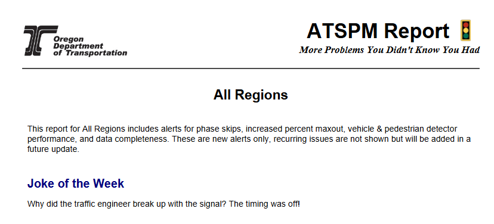
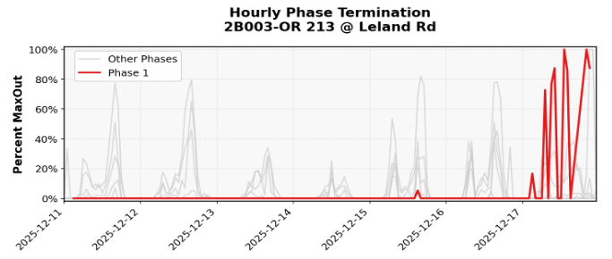
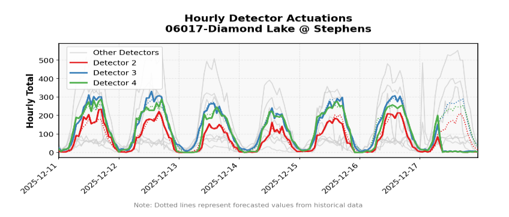
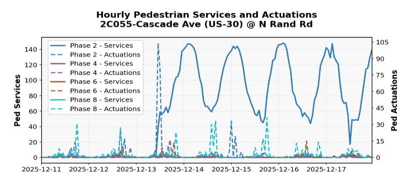
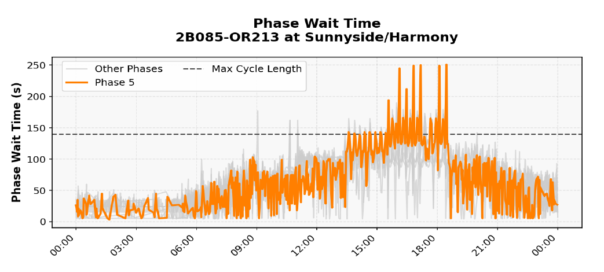

# ATSPM Report Package

[](https://github.com/ShawnStrasser/atspm-report/actions/workflows/pr-tests.yml)
[](https://pypi.org/project/atspm-report/)
[](https://codecov.io/gh/ShawnStrasser/atspm-report)
[](https://pypi.org/project/atspm-report/)
[](https://opensource.org/licenses/MIT)
[](https://pepy.tech/project/atspm-report)

A Python package for generating daily reports for new traffic signal issues. The generated report highlights new issues that just occurred, and filters out previously flagged issue.



## Features & Alert Types

This tool uses aggregate data produced by the [atspm Python package](https://github.com/ShawnStrasser/atspm) to identify 6 key types of traffic signal performance issues.

*   **Multi-region reporting**: Automatically generates separate PDF reports for each region.
*   **Alert suppression**: Configurable alert retention to prevent duplicate alerts.
*   **Custom branding**: Support for custom logos in generated PDFs.
*   **Date-based jokes**: Rotating collection of jokes in reports based on current date.

### 1. Max-Out Alerts
Detects increased percent max-out compared to historical baseline.



### 2. Actuation Alerts
Detects worsening detector performance compared to historical baseline.



### 3. Pedestrian Alerts
Detects increased ped services or changes in actuations per service ratio compared to historical baseline.



### 4. Missing Data Alerts
Detects when signals are offline or missing data more than usual.

### 5. Phase Skip Alerts
Detects when phase wait times (without preempt present) are more than 1.5x the cycle length, indicating a skipped phase.



### 6. System Outage Alerts
Detects system-wide outage or data loss.

## Installation

```bash
pip install atspm-report
```

## Quick Start

The `ReportGenerator` is the main entry point. It accepts configuration options and a set of DataFrames (pandas or Ibis) to generate PDF reports.

```python
import pandas as pd
from pathlib import Path
from atspm_report import ReportGenerator

# 1. Configure the generator
config = {
    'verbosity': 1,
    'alert_suppression_days': 14,
    'alert_retention_weeks': 3,
}

# 2. Load your data
# See "Input Data Schemas" below for required columns
test_data_dir = Path('tests/data')
signals = pd.read_parquet(test_data_dir / 'signals.parquet')
terminations = pd.read_parquet(test_data_dir / 'terminations.parquet')
detector_health = pd.read_parquet(test_data_dir / 'detector_health.parquet')
has_data = pd.read_parquet(test_data_dir / 'has_data.parquet')
pedestrian = pd.read_parquet(test_data_dir / 'full_ped.parquet')

# 3. Load past alerts for suppression (optional but recommended)
past_alerts = {}
for alert_type in ['maxout', 'actuations', 'missing_data', 'pedestrian', 'phase_skips', 'system_outages']:
    file_path = Path(f'past_{alert_type}_alerts.parquet')
    past_alerts[alert_type] = pd.read_parquet(file_path) if file_path.exists() else pd.DataFrame()

# 4. Generate reports
generator = ReportGenerator(config)
result = generator.generate(
    signals=signals,
    terminations=terminations,
    detector_health=detector_health,
    has_data=has_data,
    pedestrian=pedestrian,
    past_alerts=past_alerts
)

# 5. Save PDF reports
for region, pdf_bytes in result['reports'].items():
    with open(f'report_{region}.pdf', 'wb') as f:
        pdf_bytes.seek(0)
        f.write(pdf_bytes.read())
    print(f"Generated report for {region}")

# 6. Save updated alert history for next run
for alert_type, df in result['updated_past_alerts'].items():
    if not df.empty:
        df.to_parquet(f'past_{alert_type}_alerts.parquet', index=False)

# 7. Access alerts directly if needed
for alert_type, alerts_df in result['alerts'].items():
    if not alerts_df.empty:
        print(f"{alert_type}: {len(alerts_df)} alerts")
```

### Using Ibis for Large Datasets

For large datasets, you can pass Ibis tables instead of pandas DataFrames. This enables lazy evaluation and support for backends like DuckDB, Polars, and Spark.

```python
import ibis
from atspm_report import ReportGenerator

con = ibis.duckdb.connect()
signals = con.read_parquet('signals.parquet')
# ... load other tables ...

generator = ReportGenerator({'verbosity': 1})
result = generator.generate(
    signals=signals,
    # ... pass other ibis tables ...
)
```

## Configuration Options

Pass these keys in the `config` dictionary to `ReportGenerator`.

| Option | Type | Default | Description |
|--------|------|---------|-------------|
| `custom_logo_path` | str or None | None | Path to custom logo image (PNG/JPG). If None, uses default ODOT logo |
| `verbosity` | int | 1 | Output verbosity: 0=silent, 1=info, 2=debug |
| `alert_suppression_days` | int | 21 | Days to suppress repeat alerts for same signal/issue |
| `alert_retention_weeks` | int | 104 | Weeks to retain past alerts before cleanup |
| `historical_window_days` | int | 21 | Days of historical data to analyze |
| `alert_flagging_days` | int | 7 | Maximum age (days) for new alerts to be flagged |
| `suppress_repeated_alerts` | bool | True | Enable alert suppression logic |
| `figures_per_device` | int | 3 | Number of plots per device in reports |
| `phase_skip_alert_threshold` | int | 1 | Minimum skips to trigger phase skip alert |
| `phase_skip_retention_days` | int | 14 | Days to retain phase skip data |
| `joke_index` | int or None | None | Specific joke index (0-based). If None, auto-cycles by date |

## Input Data Schemas

The `generate()` method accepts pandas DataFrames or Ibis tables.

<details>
<summary><strong>signals</strong> (Required)</summary>

Signal metadata including location and regional assignment.

| Column | Type | Description | Example |
|--------|------|-------------|---------|
| DeviceId | str | Unique signal identifier (UUID) | signal_1 |
| Name | str | Signal location name | 04100-Pacific at Hill |
| Region | str | Geographic region assignment | Region 2 |

**Sample:**
```python
signals = pd.DataFrame({
    'DeviceId': ['signal_1', 'signal_2'],
    'Name': ['04100-Pacific at Hill', '2B528-(OR8) Adair St @ 4th Av'],
    'Region': ['Region 2', 'Region 1']
})
```
</details>

<details>
<summary><strong>terminations</strong> (Optional)</summary>

Phase termination data for detecting max-out conditions.

| Column | Type | Description | Example |
|--------|------|-------------|---------|
| TimeStamp | datetime | Event timestamp | 2024-01-15 08:30:00 |
| DeviceId | str | Signal identifier (UUID) | signal_1 |
| Phase | int | Phase number (1-8) | 2 |
| PerformanceMeasure | str | Termination type | MaxOut, ForceOff, GapOut |
| Total | int | Number of occurrences | 45 |

**Sample:**
```python
terminations = pd.DataFrame({
    'TimeStamp': pd.to_datetime(['2024-01-15 08:30:00', '2024-01-15 08:35:00', '2024-01-15 08:35:00']),
    'DeviceId': ['signal_1'] * 3,
    'Phase': [2, 2, 4],
    'PerformanceMeasure': ['MaxOut', 'GapOut', 'ForceOff'],
    'Total': [30, 15, 12]
})
```
</details>

<details>
<summary><strong>detector_health</strong> (Optional)</summary>

Detector actuation counts for health monitoring.

| Column | Type | Description | Example |
|--------|------|-------------|---------|  
| TimeStamp | datetime | Event timestamp | 2024-01-15 00:00:00 |
| DeviceId | str | Signal identifier (UUID) | signal_1 |
| Detector | int | Detector number | 1 |
| Total | int | Actuation count | 150 |
| prediction | float | Predicted actuation count | 145.0 |
| anomaly | bool | Anomaly indicator | False |

**Sample:**
```python
detector_health = pd.DataFrame({
    'TimeStamp': pd.to_datetime(['2024-01-15 08:00:00', '2024-01-15 08:00:00']),
    'DeviceId': ['signal_1', 'signal_1'],
    'Detector': [1, 2],
    'Total': [150, 5],
    'prediction': [145.0, 150.0],
    'anomaly': [False, True]
})
```
</details>

<details>
<summary><strong>has_data</strong> (Optional)</summary>

Records of data availability (presence of any record indicates data exists for that timestamp). Data is expected at 15-minute intervals (96 records per day = full availability).

| Column | Type | Description | Example |
|--------|------|-------------|---------|  
| TimeStamp | datetime | Event timestamp | 2024-01-15 00:00:00 |
| DeviceId | str | Signal identifier (UUID) | signal_1 |

**Sample:**
```python
has_data = pd.DataFrame({
    'TimeStamp': pd.to_datetime(['2024-01-15 00:00:00', '2024-01-15 00:15:00', '2024-01-15 00:30:00']),
    'DeviceId': ['signal_1'] * 3
})
```
</details>

<details>
<summary><strong>pedestrian</strong> (Optional)</summary>

Pedestrian button press and service data.

| Column | Type | Description | Example |
|--------|------|-------------|---------|
| TimeStamp | datetime | Event timestamp | 2024-01-15 12:30:00 |
| DeviceId | str | Signal identifier (UUID) | signal_1 |
| Phase | int | Pedestrian phase number | 2 |
| PedActuation | int | Button press count | 5 |
| PedServices | int | Service events (walk signal) | 1 |

**Sample:**
```python
pedestrian = pd.DataFrame({
    'TimeStamp': pd.to_datetime(['2024-01-15 12:30:00', '2024-01-15 12:30:00']),
    'DeviceId': ['signal_1', 'signal_2'],
    'Phase': [2, 4],
    'PedActuation': [5, 10],
    'PedServices': [1, 2]
})
```
</details>

<details>
<summary><strong>phase_skip_events</strong> (Optional)</summary>

Raw controller events for phase skip analysis.

| Column | Type | Description | Example |
|--------|------|-------------|---------|
| deviceid | str | Signal identifier (UUID) | signal_1 |
| timestamp | datetime | Event timestamp | 2024-01-15 14:22:30 |
| eventid | int | NEMA event code | 104 |
| parameter | int | Event parameter (phase # or wait time) | 200 |

**Sample:**
```python
phase_skip_events = pd.DataFrame({
    'deviceid': ['signal_1'] * 3,
    'timestamp': pd.to_datetime(['2024-01-15 14:22:30', '2024-01-15 14:22:31', '2024-01-15 14:22:35']),
    'eventid': [612, 612, 132],  # 612=phase wait, 132=max cycle
    'parameter': [200, 200, 120]  # wait times or cycle length
})
```
</details>

<details>
<summary><strong>past_alerts</strong> (Optional)</summary>

Dictionary of past alerts by type for suppression logic.

**Structure:**
```python
past_alerts = {
    'maxout': pd.DataFrame,        # Past max-out alerts
    'actuations': pd.DataFrame,     # Past actuation alerts
    'missing_data': pd.DataFrame,   # Past missing data alerts
    'pedestrian': pd.DataFrame,     # Past pedestrian alerts
    'phase_skips': pd.DataFrame,    # Past phase skip alerts
    'system_outages': pd.DataFrame  # Past system outage alerts
}
```

**Sample:**
```python
past_alerts = {
    'maxout': pd.DataFrame({
        'DeviceId': ['signal_1', 'signal_2'],
        'Phase': [2, 4],
        'Date': pd.to_datetime(['2024-01-14', '2024-01-14'])
    }),
    'actuations': pd.DataFrame(),  # Empty if no past actuation alerts
    # ... other types
}
```
</details>

## Statistical Analysis

The package uses **CUSUM (Cumulative Sum)** with **z-score thresholds** to detect anomalies.

### Detection Method

1. **Baseline**: Calculate historical mean ($\bar{x}$) and standard deviation ($\sigma$) per signal component
2. **CUSUM**: Accumulate weighted deviations over a 7-day rolling window, with recent days weighted more heavily
3. **Alert**: Trigger when CUSUM, z-score, and minimum value thresholds are all exceeded

### Alert Thresholds

| Alert Type | CUSUM | Z-Score | Min Value | Extra |
|------------|-------|---------|-----------|-------|
| Max-Out | > 0.25 | > 4 | > 20% | Services > 30 |
| Actuations | > 0.20 | > 3.5 | > 10% | — |
| Missing Data | > 0.10 | > 3 | > 5% | — |
| Pedestrian | Combined GEH z-score < -11 | — | — | — |
| Phase Skip | Wait time > 1.5× cycle length (excluding preemption) | — | — | — |

## License

This project is licensed under the MIT License - see the [LICENSE](LICENSE) file for details.

## Support

Contributions welcome, open an issue for problems or comment for help.
