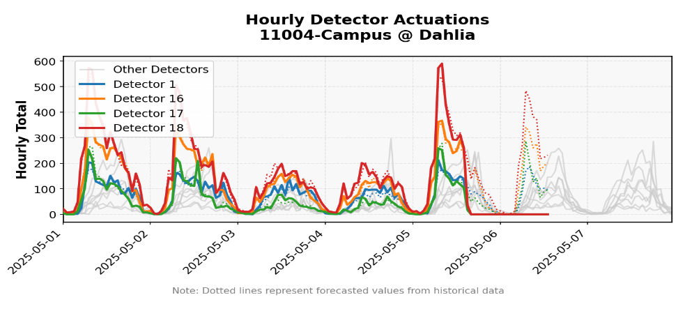

# ATSPM_Report

Generate automated reports to flag traffic signal performance issues using Automated Traffic Signal Performance Measures (ATSPM) data. This repository is in ongoing development and is being tested and used at Oregon Department of Transportation since April 2025.



## Overview

ATSPM_Report analyzes aggregated traffic signal data to identify anomalies and generates PDF reports with visualizations of potential issues. It can:

- Detect unusual patterns in signal phase max-outs
- Flag Phase Skip events where a phase waits more than 1.5× the cycle length outside of preempt windows
- Identify problematic detector actuations
- Flag missing data periods
- Monitor pedestrian phase usage
- Generate regional PDF reports with detailed visualizations
- Email reports to stakeholders automatically
- Include a "Joke of the Week" to brighten your day

This tool uses the aggregate data produced by the [atspm Python package](https://github.com/ShawnStrasser/atspm), which transforms raw high-resolution controller data into the aggregated metrics used by this repository.

## Configuration

The application is configured using a JSON configuration file (default: `config.json` in the working directory):

```json
{
  "use_parquet": true,
  "connection_params": {
    "server": "your_server_name",
    "database": "your_database_name",
    "username": "your_username"
  },
  "signals_query": "SELECT DeviceId, Name, Region FROM your_signals_table",
  "num_figures": 3,
  "email_reports": false,
  "delete_sent_emails": false,
  "verbosity": 1,
  "days_back": 21,
  "alert_flagging_days": 7,
  "output_format": "parquet",
  "alert_suppression_days": 21,
  "alert_retention_weeks": 104,
  "past_alerts_folder": "Past_Alerts",
  "use_past_alerts": true,
  "phase_skip_alert_rows_folder": "alert_rows",
  "phase_skip_phase_waits_file": "raw_data/phase_skip_phase_waits.parquet",
  "phase_skip_retention_days": 14,
  "phase_skip_alert_threshold": 2
}
```

### Key Configuration Options

- `use_parquet`: If true, read data from local parquet files. If false, connect to database.
- `connection_params`: Database connection parameters (required when `use_parquet` is false)
- `signals_query`: Custom SQL query to retrieve signal information (required when `use_parquet` is false)
- `num_figures`: Number of figures to generate per device in the report
- `email_reports`: If true, email reports instead of saving to disk
- `delete_sent_emails`: If true, Outlook deletes the sent report email instead of storing it in Sent Items
- `days_back`: Number of days of historical data to analyze
- `alert_flagging_days`: Maximum age (in days) for new alerts to be included in reports
- `alert_suppression_days`: Number of days to suppress repeated alerts for the same issue
- `use_past_alerts`: Whether to track and suppress previously reported alerts
- `phase_skip_*`: Controls where Phase Skip parquet files live, how long to keep history, and how many skips trigger alerts

### Data Requirements

Performance data must match the structure produced by the Python atspm package, and the list of traffic signals must include:

- `DeviceId`: The unique identifier for each signal
- `Name`: A human-readable name for the signal
- `Region`: The region/area the signal belongs to (e.g., "Region 1", "Region 2")

### Phase Skip Data

Phase Skip alerts use controller event data from the `DataLoad` database (or an equivalent source). This logic is intentionally kept inside `run_report.py`, which is ODOT-specific and not published when the project is shared. The daily runner must:

1. Query hires-events for the previous day (events 102, 104, 132, and 612–627).
2. Use the `transform_phase_skip_raw_data` helper (see `phase_skip_processing.py`) to build `phase_waits` and `alert_rows`.
3. Save the latest `phase_waits` to `raw_data/phase_skip_phase_waits.parquet`.
4. Save `alert_rows` to `alert_rows/<YYYY-MM-DD>.parquet` and keep only the most recent two weeks of files.

`ATSPMReport.py` simply loads those parquet artifacts, aggregates two weeks of history, suppresses previously reported device/phase pairs, and renders the Phase Skip tables/plots in the PDF.

#### Email Configuration

Emails are automatically sent from Outlook using the account on the machine where the script is run. For email functionality, create an `emails.csv` file with the following format:

```
Region,Email
Region 1,person1@example.com
Region 1,person2@example.com
Region 2,person3@example.com
All Regions,manager@example.com
```

- The "Region" column should match the region names from your signals data
- Use "All Regions" to specify recipients for the consolidated report
- Multiple email addresses can be specified for each region

Set `delete_sent_emails` to `true` in `config.json` if you want Outlook to delete the automated emails from the Sent Items folder immediately after delivery.

## Usage

### Command Line

Run with default configuration:
```
python ATSPMReport.py
```

Specify a different configuration file:
```
python ATSPMReport.py --config path/to/config.json
```


### Import as Module (not tested yet)

The script can also be imported and used programmatically:

```python
from ATSPMReport import main

# Using a config file
result = main(config_path="path/to/config.json")

# Passing parameters directly
result = main(
    use_parquet=False,
    connection_params={"server": "your_server", "database": "your_db", "username": "your_user"},
    num_figures=3,
    should_email_reports=True
)
```

## Generated Reports

The system generates both regional reports and an "All Regions" consolidated report:

1. **Regional Reports**: One PDF per region containing only issues for signals in that region
2. **All Regions Report**: A comprehensive PDF with issues from all regions

All reports include:
- Executive summary tables of detected issues
- Detailed time-series visualizations
- Joke of the Week section (from jokes.csv)

### Joke of the Week

Each report includes a fun traffic/engineering-related joke. Here's a sample:

> "A Photon checks into a hotel and the receptionist asks if he needs any help with his luggage. 'No thanks,' says the Photon 'I'm travelling light.'"

## Directory Structure

- `raw_data/`: Storage for parquet data files (when using parquet mode)
- `alert_rows/`: Rolling store of Phase Skip alert parquet files (one per day)
- `Past_Alerts/`: Tracking of previously reported alerts
- `images/`: Graphics used in the PDF reports

## License

See the LICENSE file for details.
