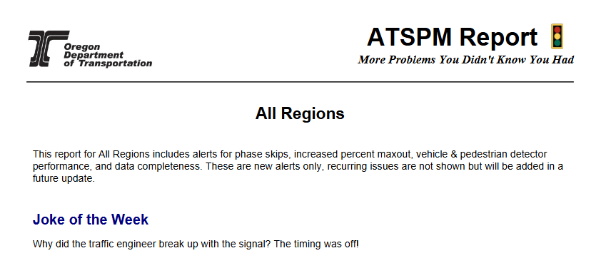
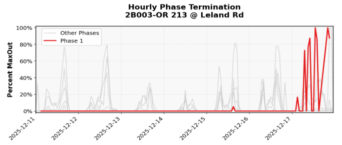
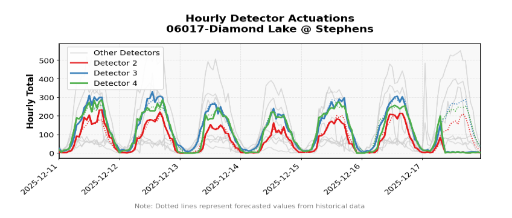
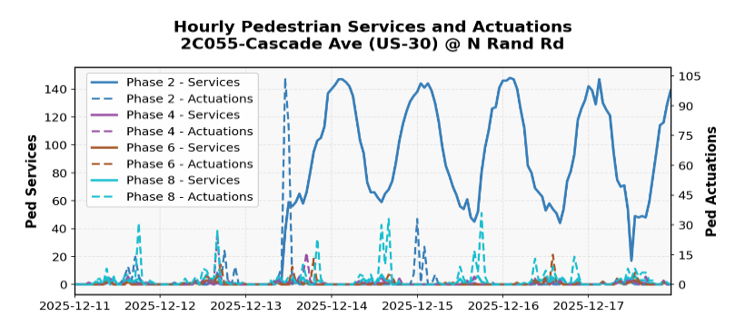
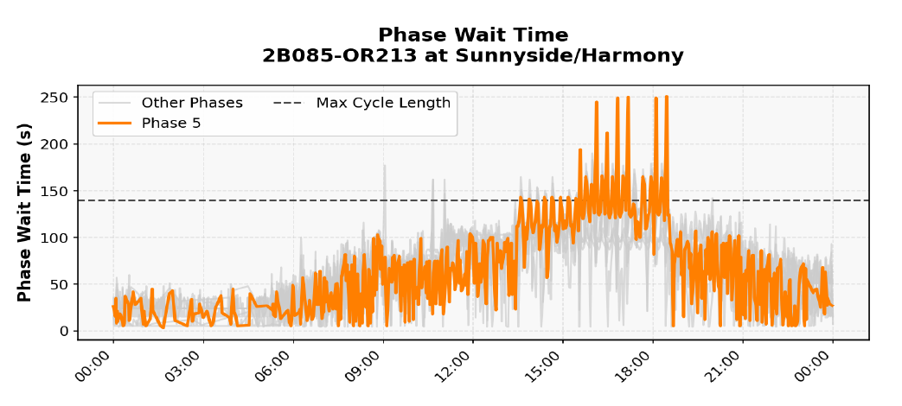

# atspm-report

[](https://github.com/ShawnStrasser/atspm-report/actions/workflows/pr-tests.yml)
[](https://pypi.org/project/atspm-report/)
[](https://codecov.io/gh/ShawnStrasser/atspm-report)
[](https://pypi.org/project/atspm-report/)
[](https://opensource.org/licenses/MIT)

Turns the output tables of the [atspm](https://github.com/ShawnStrasser/atspm) package into per-region PDF reports of **new** traffic signal issues. Repeat alerts are suppressed against history you store between runs, so each report shows what changed, not what is already known.



```bash
pip install atspm-report
```

## What it does

`ReportGenerator(config).generate(...)` takes DataFrames (pandas or Ibis), runs the detectors, suppresses repeats, and returns PDFs as `BytesIO` plus the alert tables behind them.

It does **not** fetch data, read or write files, send email, or schedule anything. You supply the inputs, save the PDFs, and persist the returned history for the next run.

## Alert types

| Section | Input | Method |
|---|---|---|
| Phase termination (max-out) | `terminations` | CUSUM on daily percent max-out per phase |
| Detector | `detector_health` | CUSUM on daily share of anomalous bins |
| Pedestrian | `pedestrian` + `terminations` | Drop in ped services relative to the phase's own median, normalized within region |
| Missing data | `has_data` | CUSUM on daily share of missing 15-min bins |
| System outage | `has_data` | Region-wide missing data >= 30% for a day |
| Phase skip | `phase_wait` | Skips summed per phase over the retention window |
| Clearance intervals | `timeline` | Yellow/red durations vs. each phase's median and absolute minimums |
| Controller alarms | `timeline` | Alarms that fired again today, with six-week totals |
| Preempt frequency | `timeline` | Two-sided Poisson CUSUM of recent daily call counts vs. baseline |
| Phase / overlap conflicts | `timeline` | Interval overlap of conflicting indications (opt-in) |

Pass only the inputs you have; every argument except `signals` is optional and a missing input just leaves its section out.

<details>
<summary>Example charts</summary>

Phase termination


Detector


Pedestrian


Phase skip

</details>

## Inputs

All inputs except `signals` come straight from atspm's output tables. `DeviceId` may be int or string in any table; it is cast to string internally.

**`signals` (required, you provide this)** one row per signal:

| Column | Notes |
|---|---|
| `DeviceId` | Unique controller id, must match the atspm tables |
| `Name` | Display name, e.g. `04100-Pacific at Hill` |
| `Region` | Grouping key, one PDF per region |
| `group_name` | Not read here, but atspm's `detector_health` aggregation needs it |

**atspm tables** and how much history to pass each run:

| Argument | atspm table | Window |
|---|---|---|
| `terminations` | `terminations` | ~21 days |
| `detector_health` | `detector_health` | ~21 days |
| `has_data` | `has_data` | ~21 days |
| `pedestrian` | `full_ped` | ~21 days |
| `phase_wait` | `phase_wait` | 14 days (`phase_skip_retention_days`) |
| `coordination_agg` | `coordination_agg` | same as `phase_wait`, chart decoration only |
| `timeline` | `timeline` | 1 day, or up to 42 days (see below) |

The CUSUM detectors compute each entity's baseline from everything you pass, so keep the window consistent.

The latest day in `timeline` is the report day, and the clearance and conflict checks only ever look at that day. The controller alarm and preempt checks need six weeks of daily counts, which you can supply either way:

- **One day of timeline.** Persist the returned `updated_alarm_history` and `updated_preempt_history` and pass them back as `alarm_history` and `preempt_history`; the counts build up over runs. Days present in the timeline replace the matching history rows, so re-running a day does not double count it.
- **Up to 42 days of timeline.** The counts are rebuilt from it every run and there is nothing to persist. Older days can be trimmed to the `ALARM_EVENT_CLASSES` and `Preempt` rows to keep it small. Add **`device_days`** (columns `DeviceId`, `Date`: the days each signal reported data) so the preempt check counts a reported day with no calls as zero; without it, reported days are inferred from each day's timeline span, which a trimmed day no longer has.

`detector_health` needs the `prediction` and `anomaly` columns, which come from atspm's `detector_health` aggregation, not the plain `actuations` one.

## Usage

```python
from pathlib import Path
import pandas as pd
from atspm_report import ReportGenerator

STATE = Path('state')
STATE.mkdir(exist_ok=True)

def load(name):
    path = STATE / f'{name}.parquet'
    return pd.read_parquet(path) if path.exists() else pd.DataFrame()

config = {'verbosity': 1}   # every key has a default, see below

result = ReportGenerator(config).generate(
    signals=signals,                 # your own table
    terminations=terminations,       # atspm outputs, pandas or Ibis
    detector_health=detector_health,
    has_data=has_data,
    pedestrian=full_ped,
    phase_wait=phase_wait,
    coordination_agg=coordination_agg,
    timeline=timeline,
    # history from the previous run (empty on the first run)
    past_alerts={k: load(f'past_{k}') for k in ReportGenerator.ALERT_TYPES},
    alarm_history=load('alarm_history'),
    preempt_history=load('preempt_history'),
)

# 1. Persist history for the next run. Store it verbatim.
for alert_type, df in result['updated_past_alerts'].items():
    df.to_parquet(STATE / f'past_{alert_type}.parquet', index=False)
# Only needed when timeline is a single day (see Inputs).
result['updated_alarm_history'].to_parquet(STATE / 'alarm_history.parquet', index=False)
result['updated_preempt_history'].to_parquet(STATE / 'preempt_history.parquet', index=False)

# 2. Do something with the PDFs. Empty dict means nothing new today.
for region, pdf in result['reports'].items():
    Path(f'report_{region}.pdf').write_bytes(pdf.getvalue())
```

Ibis tables work anywhere a DataFrame does, so a DuckDB, Polars, or Spark backend can do the heavy lifting:

```python
import ibis
con = ibis.duckdb.connect('atspm.duckdb')
result = ReportGenerator(config).generate(
    signals=con.table('signals'),
    terminations=con.table('terminations').filter(ibis._.TimeStamp >= start),
    # ...
)
```

### Returns

| Key | Contents |
|---|---|
| `reports` | `{region: BytesIO}` PDFs, only for regions with content |
| `alerts` | `{alert_type: DataFrame}` new alerts shown in the PDFs |
| `ongoing_alerts` | Suppressed repeats with an `OngoingSince` column (only when `include_ongoing_issues`) |
| `updated_past_alerts` | **Persist.** Next run's `past_alerts` |
| `updated_alarm_history` | **Persist.** Next run's `alarm_history` |
| `updated_preempt_history` | **Persist.** Next run's `preempt_history` |
| `alarms` | Controller alarms listed this run |

### State between runs

`generate()` never writes anything. Save `updated_past_alerts` and pass it back unchanged next run; do the same with `updated_alarm_history` and `updated_preempt_history` unless you pass a multi-day `timeline`, in which case those two are rebuilt every run and need not be stored. Every retention and suppression rule is already applied inside, so do not filter, dedupe, or reshape them. Dropping them does not error; it silently resets suppression, alarm totals, or the preempt baseline.

## Configuration

Pass a plain dict; every key has a default.

| Key | Default | Effect |
|---|---|---|
| `alert_suppression_days` | `21` | A matching alert this recent in history is held back as ongoing, not reported as new |
| `alert_retention_weeks` | `104` | How long `updated_past_alerts` keeps history |
| `alert_flagging_days` | `7` | Maximum age of a reportable alert |
| `include_ongoing_issues` | `False` | Add an "Ongoing Issues" subsection under each section |
| `phase_skip_alert_threshold` | `1` | Aggregated skips must exceed this |
| `phase_skip_retention_days` | `14` | Trailing days of phase-skip data kept |
| `maxout_cusum_threshold` / `maxout_zscore_threshold` / `maxout_percent_threshold` / `maxout_min_services` | `0.25` / `4.0` / `0.2` / `30` | Phase termination thresholds, all must be exceeded |
| `clearance_yellow_min_seconds` / `clearance_red_min_seconds` / `clearance_tolerance_seconds` | `3.5` / `0.5` / `0.1` | Clearance interval limits |
| `overlap_dual_indications_enabled` + `overlap_dual_indication_phases` | `False`, `[]` | Phase green concurrent with same-numbered overlap yellow/red. Never suppressed |
| `general_phase_conflicts_enabled` | `False` | Standard conflicting phases both green |
| `overlap_conflicts_enabled` + `overlap_conflict_numbers` | `False`, `[]` | Phase/overlap conflicts for the listed overlaps |
| `same_movement_color_conflicts_enabled` | `False` | One movement showing two colors at once |
| `*_excluded_signals` / `*_excluded_device_ids` | `[]` | Skip signals with non-standard phasing from the conflict checks |
| `figures_per_device` | `3` | Charts per alert section |
| `max_table_rows` | `10` | Row cap per report table |
| `custom_logo_path` | `None` | Logo for the PDF header |
| `verbosity` | `1` | `0` silent, `1` info, `2` debug |

The full list with clearance noise filters and chart options is in the `ReportGenerator` docstring.

## License

MIT, see [LICENSE](LICENSE). Contributions welcome; open an issue for problems or help.
